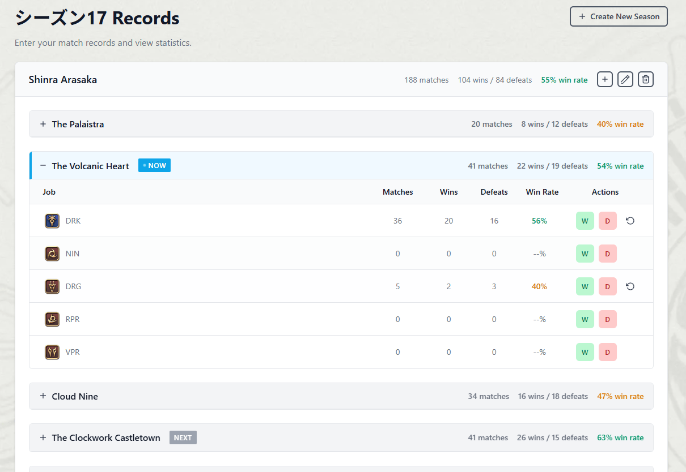

# CC War Record

クリスタルコンフリクト用戦績管理ツール

## 概要

FINAL FANTASY XIVのPvPコンテンツ「クリスタルコンフリクト」の戦績を記録・管理するWebアプリケーションです。
シーズンごとの勝敗記録を管理し、ジョブ別・全体の統計を可視化できます。

**プライバシー・データ安全性**

- 戦績データはすべてブラウザのローカルストレージに保存
- サーバーへのデータ送信は一切行いません
- Google Analyticsでは匿名化された統計情報のみ収集
- 詳細はFAQページをご確認ください

## デモ

[https://fonces.github.io/cc-war-record/](https://fonces.github.io/cc-war-record/)



## 技術スタック

### コアライブラリ

- **React** v19.1.1 - UIライブラリ（memo化パターン適用）
- **TypeScript** v5.9.3 - 型安全性（type優先、interface禁止）
- **Vite** v7.x (Rolldown) - `npm:rolldown-vite@7.1.14` 高速ビルドツール

### 状態管理

- **Zustand** v5.x - 軽量クライアント状態管理
  - characterStore - キャラクター・戦績管理
  - historyStore - シーズン履歴管理

### ルーティング

- **TanStack Router** v1.132+ - 型安全なルーティング（Devtools使用）
  - 自動生成されたルート型定義（`routeTree.gen.ts`）
  - lazyRouteComponentによるCode Splitting

### 国際化 (i18n)

- **i18next** v25.6.0 - 国際化フレームワーク
- **react-i18next** v16.x - React向け国際化ライブラリ
- **i18next-browser-languagedetector** v8.x - ブラウザ言語検出
- **対応言語**: 日本語（ja）、English（en）、한국어（ko）

### UI/UX

- **styled-components** v6.1.19 - CSS-in-JS
  - テーマシステム（ライトモード/ダークモード）
  - グラスモーフィズムデザイン
  - レスポンシブデザイン対応
- **TanStack Virtual** v3.x - 仮想スクロール（大量データの効率的な表示）
- **View Transition API** - ネイティブブラウザAPIによるページ遷移アニメーション
- **React Suspense** - 遅延読み込みコンポーネント用フォールバック
- **カスタムアニメーション**
  - アコーディオン開閉（grid-template-rows トランジション）
  - 数値変動アニメーション（AnimatedNumber）
  - フェードイン・スライドダウン効果

### PWA機能

- **vite-plugin-pwa** v1.x - Progressive Web App対応
- **workbox-window** v7.x - ServiceWorkerによるオフラインキャッシュ
  - 画像アセット (`/img/*`) の自動キャッシュ（30日間有効）
  - CacheFirstストラテジーで高速表示
  - オフラインでも動作可能

### データ可視化

- **Recharts** v3.x - グラフ・チャート描画ライブラリ
  - ComposedChart - 複合チャート（日別勝敗数+勝率ライン）
  - BarChart - 棒グラフ（時間別勝率分析）
  - AreaChart - エリアチャート（曜日別勝率比較）
  - RadarChart - レーダーチャート（マップ別ジョブ勝率比較）
  - PieChart - 円グラフ（ジョブ使用率、透過度付き）
  - カスタムツールチップ・レジェンド

### アナリティクス

- **react-ga4** v2.x - Google Analytics 4統合
  - ページビュー自動追跡（ルート変更時）
  - カスタムイベント送信機能
  - production環境でのみ動作

### Linter・Code Quality

- **ESLint** v9.x - Flat Config形式
  - eslint-plugin-import - import順序管理
  - eslint-plugin-react-hooks - Reactフック規約
  - eslint-plugin-react-refresh - HMR対応
  - グループ順序: builtin → external → internal → parent → sibling → index → type
  - アルファベット順にソート（大文字小文字を区別しない）
  - `npm run lint -- --fix`で自動整形可能

### ビルド・デプロイ

- **rollup-plugin-visualizer** v6.x - バンドルサイズ可視化ツール
  - ビルド時に `dist/stats.html` を生成してバンドル内容を分析可能
- **gh-pages** v6.x - GitHub Pagesへの自動デプロイ

### UIコンポーネント

カスタム実装されたコンポーネント群：

- **基本コンポーネント**
  - Button - 複数バリアント（primary, outline, ghost, win, defeat）
  - Input - フォーム入力
  - Select - カスタムドロップダウン（MultiSelectと同様のリッチUI）
  - MultiSelect - 複数選択ドロップダウン
  - Checkbox - チェックボックス
  - Dialog - モーダルダイアログ
  - Icon - カスタムアイコンシステム（20種類以上）

- **レイアウトコンポーネント**
  - PageLayout - ページレイアウト
  - Flex / Grid - フレックス・グリッドレイアウト
  - Header - ヘッダーナビゲーション
  - ThemeToggle - テーマ切り替えボタン（Portal配置）
  - LanguageSelector - 言語切り替えセレクター

- **データ表示コンポーネント**
  - VirtualTable - 仮想スクロールテーブル
  - AnimatedNumber - 数値変動アニメーション（増減で方向変化）
  - JobIcon / RoleIcon - ジョブ・ロールアイコン
  - EmptyState - 空状態表示

### アイコン・画像

- **ローカル画像アセット** - FF14ジョブ・ロールアイコン
  - `/public/img/00_ROLE/` - ロールアイコン（Tank, Healer, DPS系）
  - `/public/img/01_TANK/Job/` - タンクジョブアイコン
  - `/public/img/02_HEALER/Job/` - ヒーラージョブアイコン
  - `/public/img/03_DPS/Job/` - DPSジョブアイコン
- **カスタムアイコン** - SVGベースのアイコンシステム
  - hamburger, close, home, history, chart, edit, accept, add, delete, minus, revert, detail, back, language, arrowDropDown

## 環境変数

プロジェクトでは以下の環境変数を使用します：

```bash
# ベースパス（GitHub Pagesなどでのサブパス配置用）
VITE_BASEPATH=/cc-war-record

# Google Analytics 4 測定ID（オプション）
# VITE_GA_MEASUREMENT_ID=G-XXXXXXXXXX
```

`.env.example` をコピーして `.env` を作成してください：

```bash
cp .env.example .env
```

### 環境変数の説明

- **VITE_BASEPATH**: アプリケーションのベースパス（GitHub Pagesなどでサブディレクトリに配置する場合に使用）
- **VITE_GA_MEASUREMENT_ID**: Google Analytics 4の測定ID（設定しない場合、アナリティクスは無効化されます）

## データ管理アーキテクチャ

### 状態管理の構成

#### Zustandストア（グローバル状態）

グローバルに共有されるデータの管理に使用：

##### characterStore.ts - キャラクター・戦績管理

```typescript
type CharacterState = {
  characters: Character[]      // キャラクター一覧
  matchRecords: MatchRecord[]  // 戦績記録一覧
  isLoading: boolean          // ローディング状態
  error: string | null        // エラーメッセージ
}

// 主要なアクション
- loadData()                                    // localStorageからデータ読み込み
- createCharacter(input: CreateCharacterInput)  // 新規キャラクター作成
- updateCharacter(uuid: string, name: string)   // キャラクター名更新
- deleteCharacter(uuid: string)                 // キャラクター削除
- createMatchRecord(input: CreateMatchRecordInput) // 戦績記録作成
- deleteMatchRecord(uuid: string)               // 戦績記録削除
- clearMatchRecords()                           // 全戦績記録クリア
- getCharacterStatsForSeason(seasonUuid: string) // シーズン別統計取得
- getMatchRecordsForCharacter(characterUuid: string) // キャラクター別戦績取得
```

##### historyStore.ts - シーズン履歴管理

```typescript
type HistoryState = {
  histories: History[]      // シーズン履歴一覧
  isLoading: boolean       // ローディング状態
  error: string | null     // エラーメッセージ
}

// 主要なアクション
- loadHistories()                                        // 履歴一覧読み込み
- createHistory(input: CreateHistoryInput)               // 新規シーズン作成（既存データを自動アーカイブ）
- updateHistory(uuid: string, input: UpdateHistoryInput) // シーズン情報更新
- deleteHistory(uuid: string)                            // シーズン削除（アーカイブデータも削除）
- getHistoryByUuid(uuid: string)                         // UUID指定で履歴取得
- getSortedHistories()                                   // 日付順ソート済み履歴取得
- addCharacterStats(historyUuid: string, character: Character) // キャラクター統計追加
- addUsedJob(input: AddUsedJobInput)                     // 使用ジョブ追加
- getMatchRecordsForSeason(seasonUuid: string)           // シーズンのアーカイブ戦績取得
```

### データ型定義

#### Character - キャラクター情報

```typescript
type Character = {
  uuid: string; // 一意識別子
  name: string; // キャラクター名
  createdAt: string; // 作成日時（ISO文字列）
  updatedAt: string; // 更新日時（ISO文字列）
};
```

#### MatchRecord - 戦績記録

```typescript
type MatchRecord = {
  uuid: string; // 一意識別子
  characterUuid: string; // キャラクターUUID
  seasonUuid: string; // シーズンUUID
  job: Job; // 使用ジョブ
  map: CrystalConflictMap; // マップ
  isWin: boolean; // 勝敗（true: 勝利, false: 敗北）
  memo?: string; // メモ（任意）
  recordedAt: string; // 記録日時（ISO文字列）
  createdAt: string; // 作成日時（ISO文字列）
  updatedAt: string; // 更新日時（ISO文字列）
};
```

#### CharacterStats - キャラクター戦績統計

```typescript
type CharacterStats = {
  character: Character; // キャラクター情報
  totalMatches: number; // 総試合数
  wins: number; // 勝利数
  defeat: number; // 敗北数
  winRate: number; // 勝率（0-100の数値）
  recentMatches: MatchRecord[]; // 最近の戦績記録
};
```

#### History - シーズン履歴

```typescript
type History = {
  uuid: string; // 一意識別子
  seasonName: string; // シーズン名
  characterStats: CharacterStats[]; // キャラクター戦績統計の配列
  createdAt: string; // 作成日時（ISO文字列）
  updatedAt: string; // 更新日時（ISO文字列）
};
```

### データ永続化

- **localStorage**を使用してブラウザにデータを永続化
- キー構成:
  - `cc-war-record-characters`: キャラクター一覧
  - `cc-war-record-match-records`: 現在のシーズンの戦績記録一覧
  - `cc-war-record-histories`: シーズン履歴一覧
  - `histories-{seasonUuid}`: 過去シーズンのアーカイブ戦績データ
  - `cc-war-record:radar-chart-jobs`: レーダーチャートジョブ選択
- JSON形式でシリアライズして保存
- アプリケーション起動時に各ストアが自動的にデータを読み込み
- シーズン作成時に前シーズンのデータを自動的にアーカイブ

## プロジェクト構造

```
src/
├── app/              # アプリケーション設定
│   ├── App.tsx
│   └── provider.tsx
├── components/       # 共有コンポーネント（全てmemo化済み）
│   ├── ui/           # 基本UIコンポーネント（React.memo + displayName設定）
│   │   ├── Button.tsx
│   │   ├── Input.tsx
│   │   ├── Select.tsx
│   │   ├── MultiSelect.tsx
│   │   ├── Checkbox.tsx
│   │   ├── Dialog.tsx
│   │   ├── Icon/              # アイコンコンポーネント（ディレクトリ分割）
│   │   │   ├── index.tsx      # 公開API
│   │   │   ├── types.ts       # 型定義
│   │   │   └── icons/         # 個別アイコン（14ファイル）
│   │   ├── JobIcon.tsx        # ジョブアイコンコンポーネント
│   │   ├── RoleIcon.tsx       # ロールアイコンコンポーネント
│   │   ├── LanguageSelector.tsx
│   │   └── PageLayout.tsx
│   ├── form/        # フォームコンポーネント
│   └── layout/      # レイアウトコンポーネント
│       ├── Header/
│       ├── EmptyState/        # 空状態表示（共有コンポーネント）
│       └── NotFoundPage/
├── features/        # 機能別モジュール（Feature-based構造）
│   ├── home/        # ホーム画面（キャラクター管理）
│   │   ├── components/
│   │   │   ├── HomePage.tsx
│   │   │   ├── CharacterCard.tsx
│   │   │   ├── CharacterForm.tsx
│   │   │   ├── DeleteCharacterDialog.tsx
│   │   │   ├── JobRegistrationDialog.tsx
│   │   │   └── MatchRecordTable/
│   │   ├── utils/
│   │   │   └── calculate.ts
│   │   └── index.ts           # 公開API
│   ├── graphs/      # グラフ・統計表示（type定義統一済み）
│   │   ├── components/
│   │   │   ├── GraphsPage.tsx
│   │   │   ├── ChartSkeleton.tsx      # ローディング表示
│   │   │   ├── DailyWinLossChart.tsx  # 日別勝敗数チャート
│   │   │   ├── HourlyWinLossChart.tsx # 時間別勝率チャート
│   │   │   ├── WeeklyWinLossChart.tsx # 曜日別勝率チャート
│   │   │   ├── JobUsageRatePieChart.tsx
│   │   │   └── JobWinRateRadarChart.tsx
│   │   ├── utils/
│   │   │   └── aggregate.ts           # データ集計ユーティリティ
│   │   └── index.ts           # 公開API
│   ├── histories/   # 履歴詳細表示
│   │   ├── components/
│   │   │   ├── HistoriesPage.tsx
│   │   │   ├── HistoryDetailPage.tsx
│   │   │   ├── NewSeasonPage.tsx
│   │   │   └── HistoryTable/
│   │   └── index.ts           # 公開API
│   └── faq/         # よくある質問ページ
│       ├── components/
│       │   └── FaqPage.tsx
│       └── index.ts           # 公開API
├── hooks/           # 共有カスタムフック
│   ├── useMapRotation.ts  # マップローテーション取得（未使用関数削除済み）
│   ├── usePageTitle.ts    # ページタイトル設定
│   ├── useScrollLock.ts   # スクロールロック
│   ├── useTranslation.ts  # 翻訳フック（react-i18nextラッパー）
│   └── index.ts
├── lib/             # 外部ライブラリ設定
│   ├── i18n.ts      # 国際化設定（import順序整理済み）
│   └── locales/     # 翻訳ファイル（ja/en/ko）
│       ├── ja/translation.json  # 日本語翻訳
│       ├── en/translation.json  # 英語翻訳
│       └── ko/translation.json  # 韓国語翻訳
├── stores/          # グローバルストア（Zustand + localStorage）
│   ├── characterStore.ts  # キャラクター・戦績管理
│   ├── historyStore.ts    # シーズン履歴管理
│   ├── index.ts           # ストア公開API
│   └── README.md          # ストア詳細ドキュメント
├── styles/          # スタイル設定
│   ├── theme.ts
│   ├── GlobalStyle.tsx
│   └── styled.d.ts
├── types/           # 型定義
│   ├── jobs.ts      # ジョブ・ロール定義
│   ├── maps.ts      # マップ定義
│   ├── history.ts   # 履歴型定義
│   └── index.ts
├── utils/           # ユーティリティ関数（未使用関数削除済み）
│   ├── colors.ts          # カラーユーティリティ
│   ├── localStorage.ts    # localStorage操作（clearLocalStorage削除済み）
│   ├── maps.ts            # マップ関連ユーティリティ（getMapAtTime削除済み）
│   ├── uuid.ts            # UUID生成・日付フォーマット（formatDate等削除済み）
│   └── index.ts
└── test/            # テスト設定
    └── server/
```

このプロジェクトは **Bulletproof React** のアーキテクチャパターンに準拠しています。

## セットアップ

### 依存関係のインストール

```bash
npm install
```

### 環境変数の設定

`.env.example` をコピーして `.env` を作成：

```bash
cp .env.example .env
```

デフォルトの設定内容：

```bash
# ベースパス（GitHub Pagesなどでのサブパス配置用）
VITE_BASEPATH=/cc-war-record
```

ローカル開発時は以下のように変更することも可能：

```bash
VITE_BASEPATH=/
```

### 開発サーバーの起動

```bash
npm run dev
```

ブラウザで `http://localhost:5173/` を開きます。

### ビルド

```bash
npm run build
```

### プレビュー

```bash
npm run preview
```

## デプロイ

### GitHub Pagesへの自動デプロイ

mainブランチへのプッシュで自動的にGitHub Pagesにデプロイされます。

#### 初回設定

1. GitHubリポジトリの Settings > Pages に移動
2. Source を **GitHub Actions** に設定
3. mainブランチにプッシュすると自動デプロイが開始されます

デプロイURL: `https://fonces.github.io/cc-war-record/`

#### 手動デプロイ（非推奨）

```bash
npm run deploy
```

※ GitHub Actionsによる自動デプロイを推奨します

## 開発ガイド

### コンポーネント作成

新しいコンポーネントは `src/components/ui/` に配置します：

```tsx
// src/components/ui/YourComponent.tsx
import styled from "styled-components";

const Container = styled.div`
  // スタイル
`;

export const YourComponent = () => {
  return <Container>Content</Container>;
};
```

### Feature作成

新しい機能は `src/features/` 配下にディレクトリを作成します：

```
src/features/your-feature/
├── api/           # API呼び出し
├── components/    # Feature固有のコンポーネント
├── hooks/         # Feature固有のフック
├── stores/        # Feature固有の状態管理
├── types.ts       # 型定義
└── index.ts       # エクスポート
```

### パスエイリアス

`@/` でsrcディレクトリを参照できます：

```tsx
import { Button } from "@/components/ui";
import { useAuth } from "@/features/auth";
```

## GitHub Copilot設定

このプロジェクトにはGitHub Copilotの設定が含まれています：

- `.github/instructions/codeGeneration.instructions.md` - コード生成ガイドライン
  - React v19.1.1、Vite 7.x、TypeScript v5.9.3対応
  - memo化ルール（UIコンポーネント必須）
  - type優先ルール（interface禁止）
  - import順序ルール（ESLint設定準拠）
- `.github/instructions/commitMessage.instructions.md` - コミットメッセージルール
- `.vscode/cSpell.json` - スペルチェック設定（技術用語・プロジェクト固有単語を登録）

## ライセンス

MIT

## 主な機能

### 多言語対応 (i18n)

- **3言語対応**: 日本語、英語、韓国語
- **自動言語検出**: ブラウザの言語設定を自動検出
- **言語切り替え**: ヘッダーの言語セレクターで動的切り替え
- **設定永続化**: 選択した言語をローカルストレージに保存
- **動的タイトル更新**: ページタイトルとHTML lang属性の自動更新

### FAQ・プライバシー情報

- **よくある質問ページ**
  - データ保存場所・プライバシーポリシーの説明
  - 戦績データのローカルストレージ保存について詳細記載
  - Google Analyticsの収集情報と匿名性の説明
  - データ削除方法とブラウザ操作手順
  - アプリケーションの使い方に関するFAQ

### 戦績記録

- **勝利/敗北ボタン**による手動入力
- タイムスタンプ付きで記録を自動保存
- シーズンごとに記録を分類管理

### 統計・分析

- **ジョブ別統計**
  - 各ジョブごとの勝率、試合数を集計
  - ジョブ別の戦績推移を確認
- **全体統計**
  - シーズン全体の勝率、総試合数
  - 日別・時間別・曜日別の戦績推移

### データ可視化（Rechartsライブラリ使用）

- **日別勝敗数チャート**（ComposedChart）
  - 2ヶ月間の日毎勝敗推移を表示（Bar）
  - 勝率ラインを重ね合わせ（Line）
  - キャラクター・ジョブ・マップでフィルタリング可能
- **時間別勝率チャート**（BarChart）
  - 0-23時の時間帯別勝率分析
  - プレイ時間による勝率傾向を可視化
- **曜日別勝率比較**（AreaChart）
  - Sun-Satの曜日別勝率をエリアチャートで表示
  - connectNulls機能でデータ欠損日を補間
- **ジョブ別勝率レーダーチャート**（RadarChart）
  - マップ別の最大5ジョブ勝率比較
  - ジョブ選択状態をlocalStorageに永続化
- **ジョブ使用率円グラフ**（PieChart）
  - 各ジョブの使用頻度を可視化
  - キャラクター・マップでフィルタリング可能

### パフォーマンス最適化

#### React最適化戦略

- **UIコンポーネントのmemo化**（11コンポーネント）
  - Button, Checkbox, Dialog, Icon, Input, JobIcon, LanguageSelector, MultiSelect, PageLayout, RoleIcon, Select
  - すべてにdisplayName設定済み
  - 不要な再レンダリングを防止
- **グラフページの最適化**
  - 全チャートコンポーネント（5つ）にカスタム比較関数付きmemoを実装
  - `history.uuid`, `matchRecords.length`, `characters.length` で精密な比較
  - レスポンス速度を向上
- **useCallbackによる関数メモ化**
  - MapSectionコンポーネントのハンドラー関数（onAddWin, onAddDefeat, onRevertLast）
  - 子コンポーネント（JobSummaryTable）への不要な再レンダリング防止

#### ルーティング最適化

- **Code Splitting（コード分割）**
  - 全ルートで`lazyRouteComponent`を使用した動的インポート
  - 初期バンドルサイズの削減
  - ページごとに必要なコードのみ読み込み
- **React Suspense**
  - ローディングフォールバックコンポーネント実装
  - スピナーアニメーション付きローディング表示
  - 遅延読み込み時のUX改善
- **TanStack Router キャッシュ戦略**
  - `/graphs` ルートに5分間の `staleTime` を設定
  - 10分間の `gcTime` でメモリにキャッシュを保持
  - ページ遷移時の再フェッチを最小化
- **TanStack Router Devtools**
  - 開発環境でルーターの状態をデバッグ可能

#### レンダリング最適化

- **Recharts アニメーション無効化**
  - 全チャート要素に `isAnimationActive={false}` を適用
  - 初回レンダリング時間を短縮（300-600ms削減）
  - キャッシュからの復元時も即座に表示
- **TanStack Virtual による仮想スクロール**
  - 大量の戦績データを効率的に表示（HistoryDetailPage）
  - DOMノード数を最小限に抑え、スクロールパフォーマンスを向上

#### コード整理による最適化

- **未使用関数の削除**（5関数、113行削減）
  - formatDate, formatDateShort, clearLocalStorage, getMapAtTime, useCurrentMapWithTimer
- **Icon.tsxのディレクトリ分割**（190行 → 17ファイル）
  - 保守性向上とバンドルサイズ最適化
- **import順序統一**（ESLint自動整形）
  - 全42ファイルの整理完了

## 主要機能

### キャラクター管理

- キャラクター作成・編集・削除
- キャラクター別戦績統計表示
- アコーディオン形式でのキャラクター一覧表示

### シーズン管理

- シーズン（履歴）の作成・管理
- 新シーズン作成時の自動データアーカイブ
- 過去シーズンの戦績閲覧（仮想スクロール対応）
- シーズン別キャラクター統計の管理
- 最新シーズンの自動選択

### 戦績記録

- ジョブ選択ダイアログでの戦績登録
- マップ・勝敗情報の記録
- リアルタイムでの統計更新

### ジョブ・マップ対応

- FF14の全ジョブに対応（ロール別分類）
  - Tank: Paladin, Warrior, Dark Knight, Gunbreaker
  - Healer: White Mage, Scholar, Astrologian, Sage
  - Melee DPS: Monk, Dragoon, Ninja, Samurai, Reaper, Viper
  - Physical Ranged DPS: Bard, Machinist, Dancer
  - Magical Ranged DPS: Black Mage, Summoner, Red Mage, Pictomancer
- クリスタルコンフリクト全マップに対応
- ローカル画像アセットでジョブ・ロールアイコンを表示
- 環境変数（VITE_BASEPATH）対応のパス管理

### UI/UXコンポーネント

- **JobIcon** - ジョブアイコン表示コンポーネント
- **RoleIcon** - ロールアイコン表示コンポーネント
- **MultiSelect** - 複数選択可能なセレクトボックス（最大5選択）
- **LanguageSelector** - 言語切り替えセレクター
  - 3言語対応（日本語・英語・韓国語）
  - プルダウン表示方向の選択可能（up/down）
  - Select.tsxと統一されたデザイン
  - サイドバー下部に配置
- **Dialog** - モーダルダイアログ
  - 背景スクロールロック機能（useScrollLock）
  - スクロールバー表示維持
- **ページタイトル** - usePageTitleフックによる動的タイトル設定

### 国際化 (i18n) 機能

### 対応言語

- **日本語 (ja)** - デフォルト言語
- **英語 (en)** - English
- **韓国語 (ko)** - 한국어

### 言語切り替え機能

- **自動検出**: ブラウザの言語設定を自動検出（i18next-browser-languagedetector）
- **手動切り替え**: サイドバー下部の言語セレクターから選択
  - デスクトップ: 常にサイドバー下部に表示
  - モバイル: ドロワーメニュー下部に表示
- **永続化**: 選択した言語をローカルストレージに保存
- **動的更新**: ページタイトルとHTML lang属性が自動更新
- **UI統一**: Select.tsxと統一されたデザイン（8px border-radius、box-shadow対応）

### 翻訳ファイル構成

```
src/lib/locales/
├── ja/translation.json  # 日本語翻訳
├── en/translation.json  # 英語翻訳
└── ko/translation.json  # 韓国語翻訳
```

### 翻訳キー構造

```typescript
// 使用例
const { t } = useTranslation();

// 基本的な翻訳
t("common.appName"); // アプリ名
t("navigation.home"); // ナビゲーションラベル
t("pages.home.title"); // ページタイトル

// パラメーター付き翻訳
t("pages.home.title", { seasonName: "Season 1" });

// 配列データの翻訳
t("pages.faq.privacy.dataStorage.answer.points", { returnObjects: true });
```

### 用語の統一

- **勝利/敗北**: 統一された表現
  - `match.win`: "勝利" (Victory / 승리)
  - `match.defeat`: "敗北" (Defeat / 패배)
  - `stats.wins`: "{{count}}勝利"
  - `stats.defeats`: "{{count}}敗北"
- **型定義の統一**: type優先（interface禁止）
  - 全グラフコンポーネント: interface → type統一済み
  - 例外: `*.d.ts`, `routeTree.gen.ts`のみinterface許可

### 新しい翻訳の追加方法

1. `src/lib/locales/ja/translation.json` に日本語キーを追加
2. 対応する英語・韓国語翻訳を各ファイルに追加
3. `useTranslation` フックでtキーを使用

## 使用方法

### 基本的な流れ

1. **シーズン作成**: 新シーズンを作成または既存シーズンを選択
2. **キャラクター登録**: 使用キャラクターを作成・選択
3. **戦績記録**: ジョブ・マップを選択して勝敗を記録
4. **データ分析**: グラフページで各種チャートを確認

### 詳細手順

#### 0. FAQ・プライバシー情報の確認

- ナビゲーションから「FAQ」を選択
- データの保存場所・プライバシーポリシーを確認
- アプリケーションの使い方やよくある質問への回答を確認

#### 1. ホーム画面での戦績記録

- キャラクター一覧から対象キャラクターを選択
- 「戦績を記録」ボタンでジョブ選択ダイアログを開く
- ジョブ・マップを選択して「勝利」「敗北」ボタンをクリック
- 戦績が自動的に記録され、統計が更新される

#### 2. グラフ画面での分析

- ナビゲーションから「グラフ」を選択
- 5種類のチャートで多角的に戦績を分析:
  - **日別勝敗数と勝率推移**: 長期トレンドの確認
  - **時間帯別勝率分析**: 最適プレイ時間の発見
  - **曜日別勝率比較**: 平日・休日パフォーマンスの差
  - **ジョブ使用率**: よく使用するジョブの確認
  - **マップ別ジョブ勝率比較**: ジョブとマップの相性分析
- 各チャートでキャラクター・ジョブ・マップによるフィルタリングが可能

#### 3. 履歴管理

- 過去シーズンの戦績確認
- シーズン間の成長・変化の分析

## グラフ機能詳細

### 共通機能

全てのチャートコンポーネントは共通のスタイルコンポーネント (`ChartContainer.tsx`) を使用し、統一されたUI/UXを提供します。

### 1. 日別勝敗数と勝率推移チャート（DailyWinDefeatChart）

- **表示期間**: シーズン作成日から2ヶ月間
- **チャートタイプ**: ComposedChart（Bar + Line）
- **データ**: 日毎の勝利数・敗北数（Bar）+ 勝率ライン（Line）
- **Y軸**: 左軸（試合数）、右軸（勝率0-100%）
- **フィルター**: キャラクター・ジョブ・マップ

### 2. 時間帯別勝率分析チャート（HourlyWinDefeatChart）

- **表示範囲**: 0時-23時（24時間）
- **チャートタイプ**: BarChart（棒グラフ）
- **データ**: 時間帯別勝率（パーセンテージ）
- **ツールチップ**: 勝利数・敗北数・合計試合数を表示
- **用途**: プレイ時間による勝率傾向分析
- **フィルター**: キャラクター・ジョブ・マップ

### 3. 曜日別勝率比較チャート（WeeklyWinDefeatChart）

- **表示範囲**: 日曜日-土曜日（Sun-Sat）
- **チャートタイプ**: AreaChart（エリアチャート）
- **データ**: 曜日別勝率・敗率
- **特徴**: connectNulls機能でデータ欠損日を補間
- **ツールチップ**: 勝利数・敗北数・合計試合数を表示
- **用途**: 平日・休日による勝率差分析
- **フィルター**: キャラクター・ジョブ・マップ

### 4. ジョブ使用率円グラフ（JobUsageRatePieChart）

- **チャートタイプ**: PieChart（円グラフ）
- **データ**: 各ジョブの使用頻度（パーセンテージ）
- **ラベル**: 5%以上のジョブに使用率を表示
- **カラー**: JOB_INFOで定義されたジョブカラー
- **ツールチップ**: ジョブ名・使用回数・使用率
- **ソート**: 使用率降順
- **フィルター**: キャラクター・マップ

### 5. マップ別ジョブ勝率比較レーダーチャート（JobWinRateRadarChart）

- **表示形式**: RadarChart（レーダーチャート）
- **データ**: マップ別の最大5ジョブ勝率比較
- **軸**: 各クリスタルコンフリクトマップ
- **ツールチップ**: 勝率を%付きで表示
- **永続化**: ジョブ選択状態をlocalStorageに保存
- **用途**: ジョブ・マップ相性分析
- **フィルター**: キャラクター
- **選択方式**: MultiSelectによる複数ジョブ選択（最大5）

## マップローテーション機能

- **useMapRotation フック**: 現在のマップと次のマップをリアルタイムで取得
- **表示場所**: ホーム画面のマップ別戦績テーブル
- **自動更新**: マップ切り替え時刻に自動的に更新
- **視覚的表示**: 現在のマップに「Now」バッジ、次のマップに「Next」バッジを表示

## 共通機能

- **レスポンシブ対応**: 画面サイズに自動調整
- **カスタムツールチップ**: 詳細データ表示
- **カラーテーマ**: ジョブ別・勝敗別の色分け
- **フィルタリング**: 複数条件での絞り込み分析

## 注意事項・制限事項

### データプライバシー・セキュリティ

詳細なプライバシーポリシーとデータの取り扱いについては **FAQページ** をご確認ください。

### データ永続化の制限

- ブラウザのlocalStorageに依存しているため、以下の操作でデータが消失します：
  - ブラウザのキャッシュ/Cookie削除
  - プライベートブラウジングモードの使用
  - localStorageのクリア
  - ブラウザの再インストール

### 推奨環境

- **ブラウザ**: Chrome, Firefox, Safari, Edge（最新版）
- **画面解像度**: 1024px以上（レスポンシブ対応済み）
- **JavaScript**: 有効である必要があります

### データ量制限

- localStorageの容量制限（通常5-10MB）
- 大量の戦績データ蓄積時は動作速度に影響する可能性

### 今後の改善予定

- データのエクスポート・インポート機能
- クラウド同期機能
- より詳細な統計分析機能
- モバイルアプリ版の検討

## ライセンス

このプロジェクトのライセンスについては、[LICENSE](LICENSE)ファイルを参照してください。
